# Arquitectura Técnica Completa - Portal de Innovación GTTD
## Narrativa del Diagrama de Arquitectura

**Versión:** 1.0  
**Fecha:** 30 de enero de 2025  
**Propósito:** Documentar la arquitectura técnica completa del Portal de Innovación GTTD con focus en interacciones, flujo de datos y seguridad.

---

## 🏗️ **ARQUITECTURA DE 4 CAPAS DESACOPLADAS**

### **Visión General de la Arquitectura**


---

## 🎯 **CAPA FRONTEND - Next.js 15 + React 19**

### **Arquitectura de Componentes**
```
📁 Frontend Architecture
├── 🏠 app/ (App Router)
│   ├── layout.tsx (Root Layout + Providers)
│   ├── page.tsx (Main App Logic)
│   └── globals.css (Tailwind Base)
├── 🧩 components/
│   ├── 🎨 ui/ (shadcn/ui Base Components)
│   │   ├── button.tsx
│   │   ├── card.tsx
│   │   ├── dialog.tsx
│   │   ├── input.tsx
│   │   └── [30+ more components]
│   ├── 💬 chat-interface.tsx (Conversational UI)
│   ├── 📊 leader-dashboard.tsx (Domain Leader)
│   ├── 🌍 global-dashboard.tsx (Executive Leader)
│   ├── 🔍 request-detail-modal.tsx (Focus Mode)
│   └── 📈 reports-analytics.tsx (Analytics)
└── 🎣 hooks/
    ├── use-mobile.tsx
    └── use-toast.ts
```

### **Diseño Responsivo y Accesibilidad**
- **Sistema de Diseño:** shadcn/ui + Tailwind CSS
- **Tema Corporativo:** Colores UTP (Azul #0066CC, Rojo #CC0000)
- **Modo Oscuro/Claro:** next-themes con persistencia
- **Responsive:** Mobile-first approach
- **Accesibilidad:** ARIA labels + keyboard navigation

### **Gestión de Estado**
```typescript
// Estado centralizado en page.tsx
const [currentUser, setCurrentUser] = useState<User | null>(null);
const [currentView, setCurrentView] = useState<View>('dashboard');
const [notifications, setNotifications] = useState<Notification[]>([]);

// Context providers para estado global
<ThemeProvider>
  <NotificationProvider>
    <AuthProvider>
      <MainApp />
    </AuthProvider>
  </NotificationProvider>
</ThemeProvider>
```

---

## ⚙️ **CAPA ORQUESTACIÓN - n8n Backend**

### **Arquitectura de Workflows**


### **InsightBot Agent Workflow (Agente 1)**
```yaml
Workflow: "InsightBot_Agent_Workflow"
Nodes:
  1. Webhook Chat Input:
     - Path: /insightbot/chat
     - Method: POST
     - Response: JSON
     
  2. AI Memory Manager:
     - Type: Window Buffer Memory
     - Session ID: conversationId
     - Context Window: 10 messages
     - Persistent storage in PostgreSQL
     
  3. InsightBot AI Agent:
     - Model: Gemini 1.5 Pro
     - Temperature: 0.7
     - Max Tokens: 1000
     - Tools: [context_analyzer, data_extractor]
     
  4. Context Analyzer Tool:
     - Sentiment analysis
     - Urgency detection
     - System mention extraction
     
  5. Data Extractor Tool:
     - Structured data extraction
     - Completeness scoring
     - Field validation
     
  6. Supabase Save:
     - Table: conversations
     - Auto-generated fields
     - Relationship linking
```

### **RAG Planificador Workflow (Agente 2)**
```yaml
Workflow: "Planificador_RAG_Workflow"
Nodes:
  1. Document Ingestion:
     - File processing (PDF, DOC, TXT)
     - Text extraction
     - Chunking strategy
     
  2. Embedding Generation:
     - Model: Gemini Embeddings
     - Dimension: 1536
     - Cache optimization
     
  3. Vector Storage:
     - Database: Supabase + pgvector
     - Similarity search function
     - Index optimization
     
  4. Retrieval Process:
     - Query embedding
     - Similarity matching
     - Context ranking
     
  5. Generation:
     - RAG prompt construction
     - Gemini Pro analysis
     - Structured report output
```

### **API Endpoints Expuestos**
```typescript
// Endpoints disponibles desde n8n
POST /webhook/auth/login          // Autenticación
POST /webhook/chat/send           // Chat principal
POST /webhook/chat/finalize       // Finalizar conversación
GET  /webhook/requests/my-requests // Solicitudes del usuario
GET  /webhook/requests/{id}       // Detalle de solicitud
GET  /webhook/requests/domain     // Solicitudes por dominio
POST /webhook/requests/{id}/status // Cambiar estado
POST /webhook/requests/{id}/analyze // Análisis RAG
POST /webhook/projects/formalize  // Crear en Monday.com
```

---

## 🧠 **CAPA INTELIGENCIA - Google Gemini**

### **Configuración de Modelos**
```typescript
// Gemini 1.5 Pro para conversación
const conversationalModel = {
  model: "gemini-1.5-pro",
  temperature: 0.7,
  maxOutputTokens: 1000,
  topP: 0.9,
  topK: 40
};

// Gemini Embeddings para RAG
const embeddingModel = {
  model: "text-embedding-004",
  dimensions: 1536,
  taskType: "RETRIEVAL_DOCUMENT"
};
```

### **Pipeline RAG Completo**

```mermaid
graph TD
    A[Documento Histórico] --> B[Text Extraction]
    B --> C[Chunking Strategy]
    C --> D[Generate Embeddings]
    D --> E[Store in pgvector]
    
    F[Nueva Consulta] --> G[Query Embedding]
    G --> H[Similarity Search]
    H --> I[Context Retrieval]
    I --> J[Prompt Augmentation]
    J --> K[Gemini Generation]
    K --> L[Structured Response]
```


### **Clasificación Inteligente**
```typescript
// Rúbricas de clasificación automática
const classificationRules = {
  project: {
    criteria: [
      "budget > 5000",
      "duration > 40 hours", 
      "multiple_platforms",
      "team_size > 2"
    ]
  },
  requirement: {
    criteria: [
      "budget <= 5000",
      "duration <= 40 hours",
      "single_platform",
      "team_size <= 2"
    ]
  }
};

// Priorización automática
const priorityMatrix = {
  P1: ["regulatory", "critical_failure", "strategic_objective"],
  P2: ["high_impact", "significant_efficiency"],
  P3: ["incremental_improvement"],
  P4: ["minor_change"]
};
```

---

## 💾 **CAPA PERSISTENCIA - Supabase + pgvector**

### **Esquema de Base de Datos**
```sql
-- Gestión de usuarios y roles
CREATE TABLE users (
  id UUID PRIMARY KEY DEFAULT gen_random_uuid(),
  email VARCHAR NOT NULL UNIQUE,
  name VARCHAR NOT NULL,
  role VARCHAR NOT NULL CHECK (role IN ('solicitante', 'lider_dominio', 'lider_gerencial')),
  domain VARCHAR, -- para líderes de dominio
  avatar_url TEXT,
  created_at TIMESTAMP DEFAULT NOW(),
  updated_at TIMESTAMP DEFAULT NOW()
);

-- Solicitudes principales
CREATE TABLE requests (
  id UUID PRIMARY KEY DEFAULT gen_random_uuid(),
  title VARCHAR NOT NULL,
  description TEXT,
  type VARCHAR NOT NULL CHECK (type IN ('proyecto', 'requerimiento')),
  priority VARCHAR NOT NULL CHECK (priority IN ('P1', 'P2', 'P3', 'P4')),
  status VARCHAR NOT NULL DEFAULT 'nueva',
  requester_id UUID REFERENCES users(id),
  assigned_leader_id UUID REFERENCES users(id),
  domain VARCHAR NOT NULL,
  estimated_budget DECIMAL,
  confidence_score INTEGER,
  created_at TIMESTAMP DEFAULT NOW(),
  updated_at TIMESTAMP DEFAULT NOW()
);

-- Memory del agente IA (gestionada por n8n)
CREATE TABLE langchain_memory (
  id SERIAL PRIMARY KEY,
  session_id VARCHAR(255) NOT NULL,
  memory_key VARCHAR(255) DEFAULT 'chat_history',
  memory_data JSONB NOT NULL,
  created_at TIMESTAMP DEFAULT NOW(),
  updated_at TIMESTAMP DEFAULT NOW()
);

-- Conversaciones estructuradas
CREATE TABLE conversations (
  id SERIAL PRIMARY KEY,
  conversation_id VARCHAR(255) NOT NULL,
  user_message TEXT NOT NULL,
  bot_response TEXT NOT NULL,
  extracted_data JSONB,
  triggers JSONB,
  phase VARCHAR(50),
  confidence INTEGER,
  timestamp TIMESTAMP DEFAULT NOW()
);

-- Documentos históricos con embeddings
CREATE TABLE historical_documents (
  id UUID PRIMARY KEY DEFAULT gen_random_uuid(),
  title VARCHAR NOT NULL,
  content TEXT NOT NULL,
  embedding VECTOR(1536), -- pgvector
  project_type VARCHAR,
  domain VARCHAR,
  metadata JSONB,
  created_at TIMESTAMP DEFAULT NOW()
);

-- Mensajería interna
CREATE TABLE messages (
  id UUID PRIMARY KEY DEFAULT gen_random_uuid(),
  request_id UUID REFERENCES requests(id),
  sender_id UUID REFERENCES users(id),
  receiver_id UUID REFERENCES users(id),
  content TEXT NOT NULL,
  read_at TIMESTAMP,
  created_at TIMESTAMP DEFAULT NOW()
);
```

### **Row Level Security (RLS)**
```sql
-- Habilitar RLS en todas las tablas
ALTER TABLE requests ENABLE ROW LEVEL SECURITY;
ALTER TABLE messages ENABLE ROW LEVEL SECURITY;
ALTER TABLE conversations ENABLE ROW LEVEL SECURITY;

-- Política: Usuarios ven sus propias solicitudes
CREATE POLICY "users_own_requests" ON requests
  FOR SELECT USING (auth.uid() = requester_id);

-- Política: Líderes ven solicitudes de su dominio
CREATE POLICY "leaders_domain_requests" ON requests
  FOR SELECT USING (
    EXISTS (
      SELECT 1 FROM users 
      WHERE users.id = auth.uid() 
      AND users.role IN ('lider_dominio', 'lider_gerencial')
      AND (users.domain = requests.domain OR users.role = 'lider_gerencial')
    )
  );

-- Política: Mensajes solo entre participantes
CREATE POLICY "message_participants" ON messages
  FOR SELECT USING (
    auth.uid() = sender_id OR 
    auth.uid() = receiver_id
  );
```

### **Funciones de Búsqueda Vectorial**
```sql
-- Función para búsqueda por similitud
CREATE OR REPLACE FUNCTION match_documents(
  query_embedding vector(1536),
  match_threshold float,
  match_count int
)
RETURNS TABLE (
  id uuid,
  title text,
  content text,
  similarity float
)
LANGUAGE sql STABLE
AS $$
  SELECT
    id,
    title,
    content,
    1 - (embedding <=> query_embedding) AS similarity
  FROM historical_documents
  WHERE 1 - (embedding <=> query_embedding) > match_threshold
  ORDER BY similarity DESC
  LIMIT match_count;
$$;

-- Índice optimizado para búsquedas vectoriales
CREATE INDEX ON historical_documents USING ivfflat (embedding vector_cosine_ops)
WITH (lists = 100);
```

---

## 🔗 **SERVICIOS EXTERNOS E INTEGRACIONES**

### **Monday.com Integration**
```typescript
// Configuración de conexión
const mondayConfig = {
  apiUrl: 'https://api.monday.com/v2',
  headers: {
    'Authorization': `Bearer ${process.env.MONDAY_API_TOKEN}`,
    'Content-Type': 'application/json'
  }
};

// Workflow de formalización de proyectos
const projectFormalizationFlow = {
  trigger: 'POST /webhook/projects/formalize',
  steps: [
    {
      name: 'Validate Project Data',
      validation: ['title', 'description', 'budget', 'timeline']
    },
    {
      name: 'Create Monday Project',
      mutation: `
        mutation CreateProject($name: String!, $boardId: ID!) {
          create_item(board_id: $boardId, item_name: $name, column_values: $columns) {
            id
            name
            created_at
          }
        }
      `
    },
    {
      name: 'Attach Documents',
      files: ['technical_report.pdf', 'planning_analysis.pdf']
    },
    {
      name: 'Assign Team Members',
      notifications: 'email + teams'
    },
    {
      name: 'Update Portal Status',
      status: 'formalizado'
    }
  ]
};
```

### **Jira Integration (Read-Only)**
```typescript
// Configuración de Jira
const jiraConfig = {
  host: 'https://utp.atlassian.net',
  username: process.env.JIRA_EMAIL,
  password: process.env.JIRA_API_TOKEN
};

// Sincronización de capacidad del equipo
const teamCapacitySync = {
  frequency: '*/15 * * * *', // Cada 15 minutos
  endpoint: '/rest/api/3/search',
  jql: 'assignee in membersOf("GTTD Team") AND status not in (Done, Closed)',
  
  capacityCalculation: `
    Capacity = (Available Hours - Assigned Hours) / Available Hours * 100
    
    Where:
    - Available Hours = 40 hours/week per person
    - Assigned Hours = Sum of story points * average hours per point
  `,
  
  visualization: {
    green: '0-70% (Available)',
    yellow: '70-90% (High Load)', 
    red: '90-100% (Overloaded)'
  }
};
```

### **Microsoft Teams Bot**
```typescript
// Bot configuration
const teamsBot = {
  botId: process.env.TEAMS_BOT_ID,
  botPassword: process.env.TEAMS_BOT_PASSWORD,
  
  notificationTypes: [
    {
      trigger: 'new_request',
      recipients: ['assigned_leader'],
      template: 'Nueva solicitud asignada: {{title}}',
      actions: ['View Request', 'Quick Response']
    },
    {
      trigger: 'status_change',
      recipients: ['requester', 'assigned_leader'],
      template: 'Estado actualizado: {{status}}',
      actions: ['View Details']
    },
    {
      trigger: 'escalation',
      recipients: ['executive_leader'],
      template: 'Solicitud escalada: {{title}}',
      actions: ['Review', 'Approve', 'Request Info']
    }
  ],
  
  adaptiveCards: {
    requestSummary: {
      type: 'AdaptiveCard',
      version: '1.4',
      body: [
        {
          type: 'TextBlock',
          text: '{{title}}',
          weight: 'Bolder',
          size: 'Medium'
        },
        {
          type: 'FactSet',
          facts: [
            { title: 'Tipo:', value: '{{type}}' },
            { title: 'Prioridad:', value: '{{priority}}' },
            { title: 'Domain:', value: '{{domain}}' }
          ]
        }
      ],
      actions: [
        {
          type: 'Action.OpenUrl',
          title: 'Ver en Portal',
          url: '{{portal_url}}'
        }
      ]
    }
  }
};
```

---

## 📊 **FLUJO DE DATOS E INTERACCIONES**

### **Flujo Principal: Nueva Solicitud**


### **Flujo de Análisis RAG**

```mermaid
sequenceDiagram
    participant L as Líder
    participant F as Frontend  
    participant N as n8n
    participant S as Supabase
    participant G as Gemini
    
    L->>F: Solicita análisis RAG
    F->>N: POST /webhook/requests/{id}/analyze
    N->>S: Busca documentos similares
    S->>N: Retorna matches vectoriales
    N->>G: Construye prompt RAG
    G->>N: Análisis predictivo
    N->>S: Guarda informe
    N->>F: Retorna análisis
    F->>L: Muestra informe interactivo
```


---

## 🔒 **ARQUITECTURA DE SEGURIDAD**

### **Capas de Seguridad**


### **Autenticación y Autorización**
```typescript
// Middleware de autenticación
const authMiddleware = async (req: Request, res: Response, next: NextFunction) => {
  const token = req.headers.authorization?.replace('Bearer ', '');
  
  if (!token) {
    return res.status(401).json({ error: 'No token provided' });
  }
  
  try {
    const { data: user, error } = await supabase.auth.getUser(token);
    
    if (error || !user) {
      return res.status(401).json({ error: 'Invalid token' });
    }
    
    // Verificar permisos por rol
    const hasPermission = checkPermissions(user.role, req.method, req.path);
    if (!hasPermission) {
      return res.status(403).json({ error: 'Insufficient permissions' });
    }
    
    req.user = user;
    next();
  } catch (error) {
    return res.status(401).json({ error: 'Token validation failed' });
  }
};

// Matriz de permisos
const permissions = {
  solicitante: {
    GET: ['/requests/my-requests', '/requests/:id'],
    POST: ['/chat/send', '/chat/finalize'],
  },
  lider_dominio: {
    GET: ['/requests/domain', '/requests/:id', '/team/capacity'],
    POST: ['/requests/:id/status', '/messages/send'],
    PUT: ['/requests/:id/assign']
  },
  lider_gerencial: {
    GET: ['/requests/all', '/analytics/global'],
    POST: ['/requests/:id/approve', '/projects/formalize'],
    PUT: ['/requests/:id/budget']
  }
};
```

### **Protección de Datos**
```typescript
// Encriptación de campos sensibles
import crypto from 'crypto';

const encrypt = (text: string): string => {
  const cipher = crypto.createCipher('aes-256-cbc', process.env.ENCRYPTION_KEY);
  let encrypted = cipher.update(text, 'utf8', 'hex');
  encrypted += cipher.final('hex');
  return encrypted;
};

const decrypt = (text: string): string => {
  const decipher = crypto.createDecipher('aes-256-cbc', process.env.ENCRYPTION_KEY);
  let decrypted = decipher.update(text, 'hex', 'utf8');
  decrypted += decipher.final('utf8');
  return decrypted;
};

// Audit trail
const auditLog = {
  createEntry: async (action: string, userId: string, resourceId: string, details: any) => {
    await supabase.from('audit_logs').insert({
      action,
      user_id: userId,
      resource_id: resourceId,
      details: JSON.stringify(details),
      timestamp: new Date(),
      ip_address: req.ip,
      user_agent: req.headers['user-agent']
    });
  }
};
```

---

## ⚡ **OPTIMIZACIÓN Y RENDIMIENTO**

### **Estrategias de Cache**
```typescript
// Cache de respuestas de IA
const aiCache = new Map();

const getCachedResponse = (prompt: string) => {
  const hash = crypto.createHash('md5').update(prompt).digest('hex');
  return aiCache.get(hash);
};

const setCachedResponse = (prompt: string, response: any) => {
  const hash = crypto.createHash('md5').update(prompt).digest('hex');
  aiCache.set(hash, { response, timestamp: Date.now() });
  
  // TTL de 1 hora para respuestas de IA
  setTimeout(() => aiCache.delete(hash), 3600000);
};

// Cache de embeddings
const embeddingCache = new Redis({
  host: process.env.REDIS_HOST,
  port: process.env.REDIS_PORT,
  password: process.env.REDIS_PASSWORD
});

const getCachedEmbedding = async (text: string) => {
  const hash = crypto.createHash('sha256').update(text).digest('hex');
  const cached = await embeddingCache.get(`embedding:${hash}`);
  return cached ? JSON.parse(cached) : null;
};
```

### **Monitoreo y Alertas**
```typescript
// Métricas de sistema
const systemMetrics = {
  responseTime: new Map(),
  errorRate: new Map(), 
  userSatisfaction: new Map(),
  aiAccuracy: new Map()
};

// Alertas automáticas
const alertThresholds = {
  responseTime: 3000, // ms
  errorRate: 0.05, // 5%
  aiAccuracy: 0.8, // 80%
  userSatisfaction: 4.0 // /5.0
};

const checkMetrics = async () => {
  const currentMetrics = await collectMetrics();
  
  Object.entries(alertThresholds).forEach(([metric, threshold]) => {
    if (currentMetrics[metric] > threshold || currentMetrics[metric] < threshold) {
      sendAlert(metric, currentMetrics[metric], threshold);
    }
  });
};

// Ejecutar cada 5 minutos
setInterval(checkMetrics, 300000);
```

---

## 🚀 **DEPLOYMENT Y INFRAESTRUCTURA**

### **Arquitectura de Despliegue**
```yaml
# docker-compose.yml
version: '3.8'
services:
  n8n:
    image: n8nio/n8n:latest
    ports:
      - "5678:5678"
    environment:
      - N8N_BASIC_AUTH_ACTIVE=true
      - N8N_BASIC_AUTH_USER=admin
      - N8N_BASIC_AUTH_PASSWORD=${N8N_PASSWORD}
      - WEBHOOK_URL=https://api.portal-innovacion.utp.edu.pe
      - DB_TYPE=postgresdb
      - DB_POSTGRESDB_HOST=db.supabase.co
      - DB_POSTGRESDB_PORT=5432
      - DB_POSTGRESDB_DATABASE=${DB_NAME}
      - DB_POSTGRESDB_USER=${DB_USER}
      - DB_POSTGRESDB_PASSWORD=${DB_PASSWORD}
    volumes:
      - n8n_data:/home/node/.n8n
    depends_on:
      - redis
      
  redis:
    image: redis:7-alpine
    ports:
      - "6379:6379"
    volumes:
      - redis_data:/data
      
volumes:
  n8n_data:
  redis_data:
```

### **Variables de Entorno**
```bash
# Frontend (.env.local)
NEXT_PUBLIC_SUPABASE_URL=https://xxx.supabase.co
NEXT_PUBLIC_SUPABASE_ANON_KEY=xxx
NEXT_PUBLIC_N8N_API_URL=https://api.portal-innovacion.utp.edu.pe

# Backend n8n (.env)
GOOGLE_AI_API_KEY=xxx
SUPABASE_URL=xxx
SUPABASE_SERVICE_KEY=xxx
MONDAY_API_TOKEN=xxx
JIRA_API_TOKEN=xxx
TEAMS_BOT_ID=xxx
TEAMS_BOT_PASSWORD=xxx
SMTP_HOST=smtp.utp.edu.pe
SMTP_USER=xxx
SMTP_PASSWORD=xxx
ENCRYPTION_KEY=xxx
REDIS_URL=redis://localhost:6379
```

### **URLs de Producción**
```
Frontend: https://portal-innovacion.utp.edu.pe
Backend API: https://api.portal-innovacion.utp.edu.pe
n8n Admin: https://n8n.portal-innovacion.utp.edu.pe (internal)
Database: Supabase hosted
Cache: Redis Cloud
```

---

## 📈 **MÉTRICAS Y MONITOREO**

### **KPIs Técnicos**
- **Disponibilidad del Sistema:** >99.5%
- **Tiempo de Respuesta API:** <2 segundos
- **Tiempo de Respuesta IA:** <5 segundos
- **Tasa de Error:** <1%
- **Concurrencia:** 100 usuarios simultáneos

### **KPIs de Negocio**
- **Precisión de Clasificación IA:** >85%
- **Satisfacción del Usuario:** >4.5/5
- **Adopción del Portal:** >90% en 6 meses
- **Reducción Tiempo Clarificación:** 50%
- **Mejora Entregables a Tiempo:** +15%

---

## 🔄 **ESCALABILIDAD FUTURA**

### **Consideraciones de Escalamiento**
1. **Horizontal Scaling:** Multiple n8n instances
2. **Database Sharding:** Por dominio/año
3. **CDN Integration:** Para assets estáticos
4. **Microservices:** Separar IA services
5. **Load Balancing:** Para alta disponibilidad

Este diagrama de arquitectura representa un sistema robusto, escalable y seguro que satisface todos los requerimientos del Portal de Innovación GTTD, con especial énfasis en la experiencia del usuario, la inteligencia artificial avanzada y la integración fluida con los sistemas existentes de la universidad.
