# Implementación del Agente 1: InsightBot
## Agente de IA Independiente y Adaptativo

**Versión:** 1.0  
**Fecha:** 28 de julio de 2025  
**Propósito:** Especificación técnica completa para implementar el Agente 1 (InsightBot) como un agente de IA independiente que maneja componentes ricos y descubrimiento adaptativo.

---

## 1. ARQUITECTURA DEL AGENTE 1

### 1.1 Filosofía del Agente Independiente
**Principio Central:** El agente debe ser autónomo en sus decisiones, adaptativo en sus preguntas, y proactivo en la activación de componentes ricos.

```typescript
interface InsightBotCapabilities {
  // Capacidades de descubrimiento
  adaptiveQuestioning: boolean;     // Genera preguntas contextuales
  contextualAnalysis: boolean;      // Analiza el contexto completo
  richComponentTriggers: boolean;   // Decide cuándo activar componentes
  
  // Capacidades de clasificación
  realTimeClassification: boolean;  // Clasifica mientras conversa
  sentimentAnalysis: boolean;       // Detecta urgencia/frustración
  stakeholderMapping: boolean;      // Identifica beneficiarios
  
  // Capacidades de síntesis
  informationExtraction: boolean;   // Extrae datos estructurados
  reportGeneration: boolean;        // Genera informes técnicos
  recommendationEngine: boolean;    // Sugiere próximos pasos
}
```

### 1.2 Flujo de Procesamiento Inteligente

```mermaid
graph TD
    A[Usuario envía mensaje] --> B[Agente analiza contexto completo]
    B --> C[Genera respuesta adaptativa]
    C --> D[Evalúa triggers para componentes ricos]
    D --> E[Extrae información estructurada]
    E --> F[Actualiza estado de conversación]
    F --> G[Decide próxima acción]
    G --> H[Envía respuesta + triggers]
```



---

## 2. IMPLEMENTACIÓN TÉCNICA

### 2.1 Workflow n8n para InsightBot

```json
{
  "name": "InsightBot_Agente_1",
  "nodes": [
    {
      "name": "Webhook_Chat_Input",
      "type": "n8n-nodes-base.webhook",
      "parameters": {
        "path": "chat/send",
        "httpMethod": "POST"
      }
    },
    {
      "name": "Context_Analyzer",
      "type": "n8n-nodes-base.function",
      "parameters": {
        "functionCode": `
          // Analizar contexto completo de la conversación
          const { message, conversationId, conversationHistory } = $input.item.json;
          
          // Construir contexto enriquecido
          const context = {
            currentMessage: message,
            messageCount: conversationHistory?.length || 0,
            extractedEntities: extractEntities(conversationHistory),
            conversationPhase: determinePhase(conversationHistory),
            userSentiment: analyzeSentiment(message),
            mentionedSystems: extractSystems(conversationHistory),
            stakeholders: extractStakeholders(conversationHistory)
          };
          
          return { context, originalInput: $input.item.json };
        `
      }
    },
    {
      "name": "Gemini_Intelligent_Response",
      "type": "n8n-nodes-base.googleGemini",
      "parameters": {
        "model": "gemini-2.5-pro",
        "prompt": "{{$node['Prompt_Builder'].json.intelligentPrompt}}"
      }
    },
    {
      "name": "Prompt_Builder",
      "type": "n8n-nodes-base.function",
      "parameters": {
        "functionCode": `
          const { context, originalInput } = $input.item.json;
          
          const intelligentPrompt = buildAdaptivePrompt(context, originalInput);
          
          return { intelligentPrompt, context };
        `
      }
    },
    {
      "name": "Response_Processor",
      "type": "n8n-nodes-base.function",
      "parameters": {
        "functionCode": `
          const geminiResponse = $input.item.json;
          const context = $node['Context_Analyzer'].json.context;
          
          // Procesar respuesta de Gemini
          const processedResponse = processGeminiResponse(geminiResponse, context);
          
          return processedResponse;
        `
      }
    },
    {
      "name": "Rich_Component_Evaluator",
      "type": "n8n-nodes-base.function",
      "parameters": {
        "functionCode": `
          const { context, extractedData, botResponse } = $input.item.json;
          
          // Evaluar qué componentes ricos activar
          const triggers = evaluateRichComponentTriggers(context, extractedData);
          
          return { 
            botResponse,
            triggers,
            extractedData,
            nextPhase: determineNextPhase(context, extractedData)
          };
        `
      }
    }
  ]
}
```

### 2.2 Prompt Adaptativo Inteligente

```typescript
const buildAdaptivePrompt = (context: ConversationContext, input: any) => {
  const basePrompt = `
Eres InsightBot, un agente de IA especializado en descubrimiento conversacional para solicitudes tecnológicas en UTP.

CONTEXTO ACTUAL:
- Mensaje actual: "${input.message}"
- Fase de conversación: ${context.conversationPhase}
- Mensajes intercambiados: ${context.messageCount}
- Sentimiento detectado: ${context.userSentiment}
- Sistemas mencionados: ${context.mentionedSystems.join(', ') || 'Ninguno'}
- Stakeholders identificados: ${context.stakeholders.join(', ') || 'Ninguno'}

INFORMACIÓN EXTRAÍDA HASTA AHORA:
${JSON.stringify(context.extractedEntities, null, 2)}

OBJETIVOS DE DESCUBRIMIENTO:
1. Problema raíz específico que se busca resolver
2. Objetivo de negocio claro y medible
3. Beneficiarios principales y secundarios
4. Plataformas/sistemas impactados
5. Restricciones técnicas, temporales o presupuestarias
6. Nivel de urgencia y justificación
7. Impacto esperado (cualitativo y cuantitativo)

INSTRUCCIONES ESPECÍFICAS:
${getPhaseSpecificInstructions(context.conversationPhase)}

REGLAS DE COMPORTAMIENTO:
- Sé conversacional y empático, no robótico
- Haz UNA pregunta principal por respuesta, máximo dos relacionadas
- Adapta tu estilo al sentimiento del usuario (urgente, frustrado, entusiasta)
- Si detectas información incompleta, profundiza con preguntas específicas
- Cuando tengas suficiente información, sugiere activar el resumen
- Usa ejemplos concretos para clarificar conceptos abstractos

FORMATO DE RESPUESTA REQUERIDO:
{
  "botMessage": "Tu respuesta conversacional aquí",
  "extractedData": {
    "problem": "string o null",
    "objective": "string o null", 
    "impact": "string o null",
    "platforms": ["array de strings"],
    "stakeholders": ["array de strings"],
    "urgency": "low|medium|high|critical",
    "budget": "string o null",
    "timeline": "string o null"
  },
  "triggers": {
    "platformSelector": boolean,
    "summaryCard": boolean,
    "documentUpload": boolean,
    "satisfactionSurvey": boolean,
    "urgencyIndicator": boolean
  },
  "nextPhase": "discovery|clarification|summary|complete",
  "confidence": number // 0-100, qué tan completa está la información
}

Responde SOLO con el JSON válido, sin texto adicional.
`;

  return basePrompt;
};

const getPhaseSpecificInstructions = (phase: string) => {
  switch (phase) {
    case 'discovery':
      return `
- Enfócate en entender el problema principal
- Haz preguntas abiertas para explorar el contexto
- Identifica el dominio tecnológico (académico, administrativo, infraestructura)
- Detecta el nivel de urgencia en el tono del usuario
      `;
    
    case 'clarification':
      return `
- Profundiza en aspectos específicos que faltan
- Cuantifica el impacto esperado
- Identifica restricciones técnicas o presupuestarias
- Clarifica stakeholders y beneficiarios
      `;
    
    case 'summary':
      return `
- Valida la información recopilada
- Sugiere activar la tarjeta de resumen
- Prepara para la clasificación final
- Confirma detalles críticos
      `;
    
    default:
      return `
- Mantén la conversación fluida y natural
- Adapta tu enfoque según el contexto
      `;
  }
};
```

### 2.3 Evaluador de Componentes Ricos

```typescript
const evaluateRichComponentTriggers = (
  context: ConversationContext, 
  extractedData: ExtractedData
) => {
  const triggers = {
    platformSelector: false,
    summaryCard: false,
    documentUpload: false,
    satisfactionSurvey: false,
    urgencyIndicator: false
  };

  // 1. Platform Selector - Activar cuando se mencionen sistemas
  if (extractedData.platforms.length > 0 || 
      context.mentionedSystems.length > 0 ||
      containsPlatformKeywords(context.currentMessage)) {
    triggers.platformSelector = true;
  }

  // 2. Summary Card - Activar cuando tengamos información suficiente
  const completeness = calculateInformationCompleteness(extractedData);
  if (completeness >= 70 && context.messageCount >= 4) {
    triggers.summaryCard = true;
  }

  // 3. Document Upload - Activar si mencionan archivos o documentación
  if (containsDocumentKeywords(context.currentMessage) ||
      extractedData.problem?.includes('documento') ||
      extractedData.objective?.includes('reporte')) {
    triggers.documentUpload = true;
  }

  // 4. Urgency Indicator - Activar si detectamos alta urgencia
  if (extractedData.urgency === 'high' || extractedData.urgency === 'critical') {
    triggers.urgencyIndicator = true;
  }

  // 5. Satisfaction Survey - Activar al final del proceso
  if (triggers.summaryCard && completeness >= 85) {
    triggers.satisfactionSurvey = true;
  }

  return triggers;
};

const calculateInformationCompleteness = (data: ExtractedData): number => {
  let score = 0;
  const weights = {
    problem: 25,      // Más importante
    objective: 25,    // Más importante  
    impact: 20,       // Importante
    platforms: 15,    // Moderado
    stakeholders: 10, // Moderado
    urgency: 5        // Menor
  };

  if (data.problem && data.problem.length > 10) score += weights.problem;
  if (data.objective && data.objective.length > 10) score += weights.objective;
  if (data.impact && data.impact.length > 10) score += weights.impact;
  if (data.platforms.length > 0) score += weights.platforms;
  if (data.stakeholders.length > 0) score += weights.stakeholders;
  if (data.urgency && data.urgency !== 'low') score += weights.urgency;

  return score;
};
```

---

## 3. INTEGRACIÓN CON FRONTEND

### 3.1 Hook Personalizado para Conversación Inteligente

```typescript
// hooks/useIntelligentConversation.ts
import { useState, useCallback } from 'react';

interface ConversationState {
  conversationId: string;
  messages: Message[];
  extractedData: ExtractedData;
  currentPhase: 'discovery' | 'clarification' | 'summary' | 'complete';
  confidence: number;
  isLoading: boolean;
}

export const useIntelligentConversation = () => {
  const [state, setState] = useState<ConversationState>({
    conversationId: generateConversationId(),
    messages: [],
    extractedData: {
      problem: null,
      objective: null,
      impact: null,
      platforms: [],
      stakeholders: [],
      urgency: 'low',
      budget: null,
      timeline: null
    },
    currentPhase: 'discovery',
    confidence: 0,
    isLoading: false
  });

  const sendMessage = useCallback(async (message: string) => {
    setState(prev => ({ ...prev, isLoading: true }));

    try {
      // Añadir mensaje del usuario
      const userMessage: Message = {
        id: generateId(),
        type: 'user',
        content: message,
        timestamp: new Date()
      };

      setState(prev => ({
        ...prev,
        messages: [...prev.messages, userMessage]
      }));

      // Llamar al Agente 1 (InsightBot)
      const response = await fetch(`${process.env.NEXT_PUBLIC_N8N_URL}/webhook/chat/send`, {
        method: 'POST',
        headers: {
          'Content-Type': 'application/json'
        },
        body: JSON.stringify({
          message,
          conversationId: state.conversationId,
          conversationHistory: state.messages,
          currentPhase: state.currentPhase,
          extractedData: state.extractedData
        })
      });

      if (!response.ok) {
        throw new Error('Error en la comunicación con InsightBot');
      }

      const botResponse = await response.json();

      // Procesar respuesta del agente
      const botMessage: Message = {
        id: generateId(),
        type: 'bot',
        content: botResponse.botMessage,
        timestamp: new Date(),
        triggers: botResponse.triggers
      };

      // Actualizar estado completo
      setState(prev => ({
        ...prev,
        messages: [...prev.messages, botMessage],
        extractedData: { ...prev.extractedData, ...botResponse.extractedData },
        currentPhase: botResponse.nextPhase,
        confidence: botResponse.confidence,
        isLoading: false
      }));

      return {
        botMessage: botResponse.botMessage,
        triggers: botResponse.triggers,
        extractedData: botResponse.extractedData
      };

    } catch (error) {
      console.error('Error sending message:', error);
      
      // Mensaje de error amigable
      const errorMessage: Message = {
        id: generateId(),
        type: 'bot',
        content: 'Disculpa, tuve un problema técnico. ¿Podrías repetir tu mensaje?',
        timestamp: new Date(),
        isError: true
      };

      setState(prev => ({
        ...prev,
        messages: [...prev.messages, errorMessage],
        isLoading: false
      }));

      throw error;
    }
  }, [state.conversationId, state.messages, state.currentPhase, state.extractedData]);

  const finalizeConversation = useCallback(async () => {
    try {
      const response = await fetch(`${process.env.NEXT_PUBLIC_N8N_URL}/webhook/chat/finalize`, {
        method: 'POST',
        headers: {
          'Content-Type': 'application/json'
        },
        body: JSON.stringify({
          conversationId: state.conversationId,
          extractedData: state.extractedData,
          messages: state.messages,
          confidence: state.confidence
        })
      });

      if (!response.ok) {
        throw new Error('Error al finalizar conversación');
      }

      const result = await response.json();
      
      setState(prev => ({
        ...prev,
        currentPhase: 'complete'
      }));

      return result;

    } catch (error) {
      console.error('Error finalizing conversation:', error);
      throw error;
    }
  }, [state]);

  return {
    state,
    sendMessage,
    finalizeConversation,
    isReady: state.confidence >= 70
  };
};
```

### 3.2 Componente ChatInterface Mejorado

```typescript
// components/chat-interface-intelligent.tsx
"use client"

import { useState, useEffect } from "react"
import { useIntelligentConversation } from "@/hooks/useIntelligentConversation"
import { Button } from "@/components/ui/button"
import { Input } from "@/components/ui/input"
import { Card, CardContent, CardHeader, CardTitle } from "@/components/ui/card"
import { Send, Bot, User, Sparkles, Loader2 } from "lucide-react"
import { toast } from "@/components/ui/use-toast"

export function IntelligentChatInterface() {
  const { state, sendMessage, finalizeConversation, isReady } = useIntelligentConversation();
  const [inputValue, setInputValue] = useState("");
  const [showSummary, setShowSummary] = useState(false);
  const [showPlatformSelector, setShowPlatformSelector] = useState(false);
  const [showDocumentUpload, setShowDocumentUpload] = useState(false);

  // Manejar triggers de componentes ricos
  useEffect(() => {
    const lastMessage = state.messages[state.messages.length - 1];
    if (lastMessage?.type === 'bot' && lastMessage.triggers) {
      const { triggers } = lastMessage;
      
      if (triggers.summaryCard) {
        setTimeout(() => setShowSummary(true), 2000);
      }
      
      if (triggers.platformSelector) {
        setTimeout(() => setShowPlatformSelector(true), 1500);
      }
      
      if (triggers.documentUpload) {
        setTimeout(() => setShowDocumentUpload(true), 1000);
      }
    }
  }, [state.messages]);

  const handleSendMessage = async (messageText?: string) => {
    const text = messageText || inputValue;
    if (!text.trim() || state.isLoading) return;

    try {
      await sendMessage(text);
      setInputValue("");
    } catch (error) {
      toast({
        title: "Error",
        description: "No pude procesar tu mensaje. Intenta nuevamente.",
        variant: "destructive"
      });
    }
  };

  const handleFinalize = async () => {
    try {
      await finalizeConversation();
      toast({
        title: "¡Solicitud enviada!",
        description: "Tu solicitud ha sido procesada y enviada al equipo correspondiente.",
      });
      // Redirigir a historial
      window.location.href = '/history';
    } catch (error) {
      toast({
        title: "Error",
        description: "No pude enviar tu solicitud. Intenta nuevamente.",
        variant: "destructive"
      });
    }
  };

  // Componente de Resumen Inteligente
  const IntelligentSummaryCard = () => (
    <Card className="bg-white dark:bg-gray-800 border-gray-200 dark:border-gray-700 mb-4 shadow-sm">
      <CardHeader>
        <CardTitle className="text-lg text-gray-900 dark:text-gray-100 flex items-center">
          <Sparkles className="w-5 h-5 text-blue-500 mr-2" />
          Resumen Inteligente - Confianza: {state.confidence}%
        </CardTitle>
      </CardHeader>
      <CardContent className="space-y-4">
        <div className="grid grid-cols-1 md:grid-cols-3 gap-4">
          <div className="p-4 bg-gray-50 dark:bg-gray-700/50 rounded-lg">
            <h4 className="font-medium text-gray-900 dark:text-gray-100 mb-2">🎯 Problema</h4>
            <p className="text-sm text-gray-600 dark:text-gray-400">
              {state.extractedData.problem || "Aún recopilando información..."}
            </p>
          </div>
          <div className="p-4 bg-gray-50 dark:bg-gray-700/50 rounded-lg">
            <h4 className="font-medium text-gray-900 dark:text-gray-100 mb-2">🚀 Objetivo</h4>
            <p className="text-sm text-gray-600 dark:text-gray-400">
              {state.extractedData.objective || "Aún recopilando información..."}
            </p>
          </div>
          <div className="p-4 bg-gray-50 dark:bg-gray-700/50 rounded-lg">
            <h4 className="font-medium text-gray-900 dark:text-gray-100 mb-2">📈 Impacto</h4>
            <p className="text-sm text-gray-600 dark:text-gray-400">
              {state.extractedData.impact || "Aún recopilando información..."}
            </p>
          </div>
        </div>

        {/* Información adicional */}
        {(state.extractedData.platforms.length > 0 || state.extractedData.stakeholders.length > 0) && (
          <div className="grid grid-cols-1 md:grid-cols-2 gap-4 pt-4 border-t">
            {state.extractedData.platforms.length > 0 && (
              <div>
                <h5 className="font-medium text-gray-900 dark:text-gray-100 mb-2">🖥️ Plataformas</h5>
                <div className="flex flex-wrap gap-2">
                  {state.extractedData.platforms.map((platform, index) => (
                    <span key={index} className="px-2 py-1 bg-blue-100 dark:bg-blue-900/30 text-blue-800 dark:text-blue-300 rounded text-xs">
                      {platform}
                    </span>
                  ))}
                </div>
              </div>
            )}
            
            {state.extractedData.stakeholders.length > 0 && (
              <div>
                <h5 className="font-medium text-gray-900 dark:text-gray-100 mb-2">👥 Beneficiarios</h5>
                <div className="flex flex-wrap gap-2">
                  {state.extractedData.stakeholders.map((stakeholder, index) => (
                    <span key={index} className="px-2 py-1 bg-green-100 dark:bg-green-900/30 text-green-800 dark:text-green-300 rounded text-xs">
                      {stakeholder}
                    </span>
                  ))}
                </div>
              </div>
            )}
          </div>
        )}

        <div className="flex space-x-3 pt-4">
          <Button 
            onClick={handleFinalize}
            disabled={!isReady}
            className="flex-1 bg-utp-blue hover:bg-utp-blue-dark dark:bg-utp-red dark:hover:bg-utp-red-dark text-white"
          >
            <Sparkles className="w-4 h-4 mr-2" />
            {isReady ? "✔️ Validar y Enviar" : `Completando... ${state.confidence}%`}
          </Button>
          <Button
            variant="outline"
            onClick={() => setShowSummary(false)}
            className="flex-1"
          >
            ✏️ Continuar Conversación
          </Button>
        </div>
      </CardContent>
    </Card>
  );

  return (
    <div className="flex flex-col h-full bg-white dark:bg-gray-900">
      {state.messages.length === 0 ? (
        <EmptyState onSuggestionClick={handleSendMessage} />
      ) : (
        <div className="flex-1 overflow-y-auto p-6 space-y-4">
          {/* Indicador de fase */}
          <div className="text-center">
            <span className="px-3 py-1 bg-blue-100 dark:bg-blue-900/30 text-blue-800 dark:text-blue-300 rounded-full text-xs font-medium">
              Fase: {state.currentPhase} • Confianza: {state.confidence}%
            </span>
          </div>

          {/* Mensajes */}
          {state.messages.map((message) => (
            <div key={message.id} className={`flex ${message.type === "user" ? "justify-end" : "justify-start"}`}>
              <div className={`flex max-w-[80%] ${message.type === "user" ? "flex-row-reverse" : "flex-row"}`}>
                <div className={`w-8 h-8 rounded-full flex items-center justify-center ${
                  message.type === "user"
                    ? "bg-utp-blue dark:bg-utp-red ml-3"
                    : "bg-gray-100 dark:bg-gray-800 mr-3"
                }`}>
                  {message.type === "user" ? (
                    <User className="w-4 h-4 text-white" />
                  ) : (
                    <Bot className="w-4 h-4 text-gray-600 dark:text-gray-400" />
                  )}
                </div>
                <div className={`rounded-lg p-4 ${
                  message.type === "user"
                    ? "bg-utp-blue dark:bg-utp-red text-white"
                    : message.isError
                    ? "bg-red-100 dark:bg-red-900/30 text-red-800 dark:text-red-300"
                    : "bg-gray-100 dark:bg-gray-800 text-gray-900 dark:text-gray-100"
                }`}>
                  <p className="text-sm">{message.content}</p>
                  <p className="text-xs opacity-70 mt-2">{message.timestamp.toLocaleTimeString()}</p>
                </div>
              </div>
            </div>
          ))}

          {/* Componentes ricos activados por IA */}
          {showSummary && <IntelligentSummaryCard />}
          {showPlatformSelector && <PlatformSelector onSelect={(platform) => {
            handleSendMessage(`He seleccionado la plataforma: ${platform}`);
            setShowPlatformSelector(false);
          }} />}
          {showDocumentUpload && <DocumentUploadComponent />}

          {/* Indicador de carga */}
          {state.isLoading && (
            <div className="flex justify-start">
              <div className="flex items-center space-x-2 bg-gray-100 dark:bg-gray-800 rounded-lg p-4">
                <Loader2 className="w-4 h-4 animate-spin text-gray-600 dark:text-gray-400" />
                <span className="text-sm text-gray-600 dark:text-gray-400">InsightBot está analizando...</span>
              </div>
            </div>
          )}
        </div>
      )}

      {/* Input Area */}
      <div className="p-6 border-t border-gray-200 dark:border-gray-800 bg-white dark:bg-gray-900">
        <div className="flex space-x-3">
          <Input
            value={inputValue}
            onChange={(e) => setInputValue(e.target.value)}
            placeholder="Describe tu solicitud o proyecto tecnológico..."
            className="flex-1"
            onKeyPress={(e) => e.key === "Enter" && handleSendMessage()}
            disabled={state.isLoading}
          />
          <Button
            onClick={() => handleSendMessage()}
            disabled={!inputValue.trim() || state.isLoading}
            className="bg-utp-blue hover:bg-utp-blue-dark dark:bg-utp-red dark:hover:bg-utp-red-dark text-white"
          >
            {state.isLoading ? <Loader2 className="w-4 h-4 animate-spin" /> : <Send className="w-4 h-4" />}
          </Button>
        </div>
        <p className="text-xs text-gray-500 dark:text-gray-400 mt-2">
          InsightBot está diseñado para hacer preguntas inteligentes y adaptar la conversación según tus necesidades
        </p>
      </div>
    </div>
  );
}
```

---

## 4. CONFIGURACIÓN DE ENDPOINTS

### 4.1 Variables de Entorno

```env
# .env.local
NEXT_PUBLIC_N8N_URL=https://n8n.utp.edu.pe
GEMINI_API_KEY=your_gemini_api_key_here
SUPABASE_URL=your_supabase_url
SUPABASE_ANON_KEY=your_supabase_anon_key
```

### 4.2 Endpoints Requeridos en n8n

```
POST /webhook/chat/send
- Recibe mensaje y contexto
- Procesa con Gemini
- Retorna respuesta + triggers

POST /webhook/chat/finalize  
- Recibe conversación completa
- Genera informe técnico
- Crea solicitud en BD
- Asigna a líder correspondiente
```

---

## 5. TESTING Y VALIDACIÓN

### 5.1 Casos de Prueba

```typescript
// tests/insightbot.test.ts
describe('InsightBot Agente 1', () => {
  test('Debe generar preguntas adaptativas según contexto', async () => {
    const context = {
      messageCount: 2,
      conversationPhase: 'discovery',
      extractedEntities: { problem: 'gestión de inventarios' }
    };
    
    const response = await sendToInsightBot('Necesito un sistema', context);
    
    expect(response.botMessage).toContain('inventario');
    expect(response.extractedData.problem).toBeDefined();
  });

  test('Debe activar componentes ricos inteligentemente', async () => {
    const context = {
      messageCount: 5,
      extractedEntities: { 
        problem: 'Control de equipos TI',
        objective: 'Reducir pérdidas',
        platforms: ['Canvas']
      }
    };
    
    const response = await sendToInsightBot('Usar Canvas', context);
    
    expect(response.triggers.platformSelector).toBe(true);
    expect(response.triggers.summaryCard).toBe(true);
  });
});
```

---

## 6. MÉTRICAS Y MONITOREO

### 6.1 KPIs del Agente

```typescript
interface AgentMetrics {
  conversationCompletionRate: number;    // % conversaciones que llegan a summary
  averageMessagesToCompletion: number;   // Promedio de mensajes necesarios
  informationExtractionAccuracy: number; // Precisión en extracción de datos
  userSatisfactionScore: number;         // Rating promedio de usuarios
  triggerActivationAccuracy: number;     // % de triggers correctos
}
```

Esta implementación hace que el Agente 1 sea completamente independiente, adaptativo y proactivo en la gestión de componentes ricos, cumpliendo exactamente con los requerimientos solicitados.
